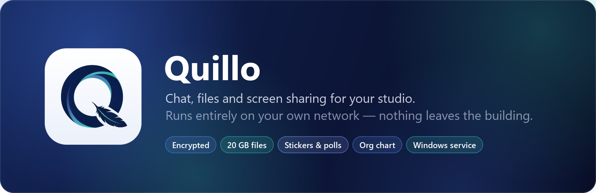
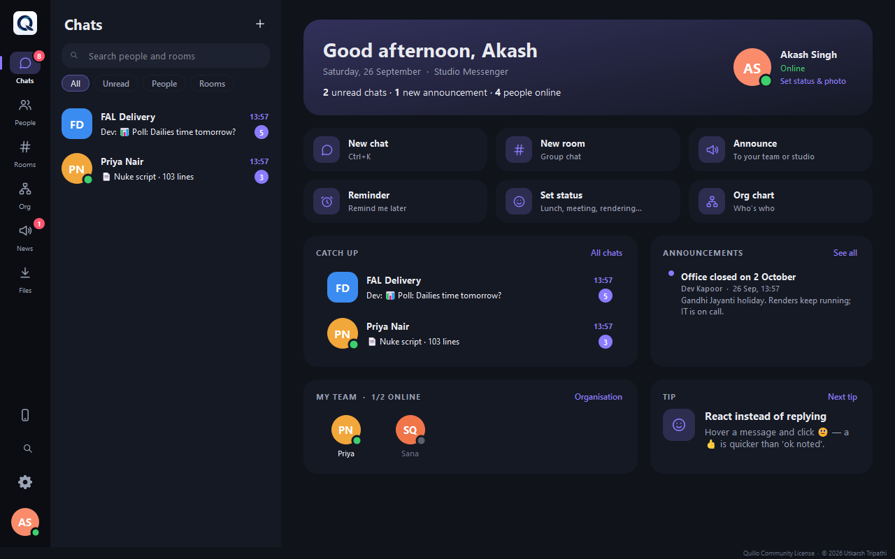
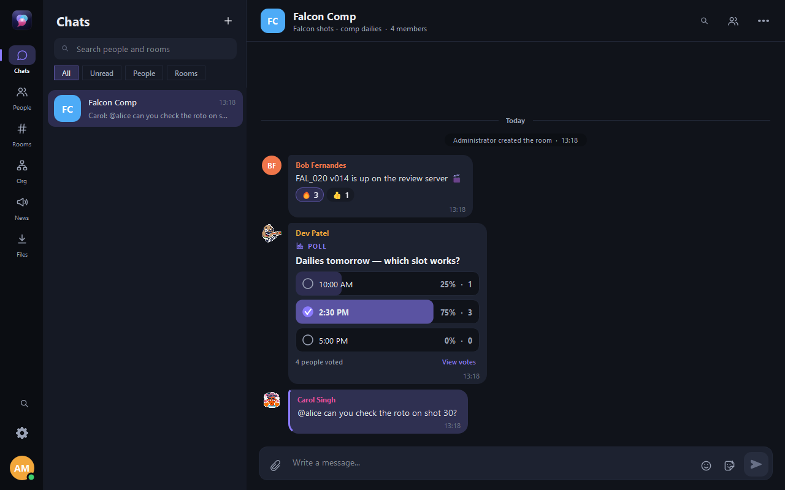
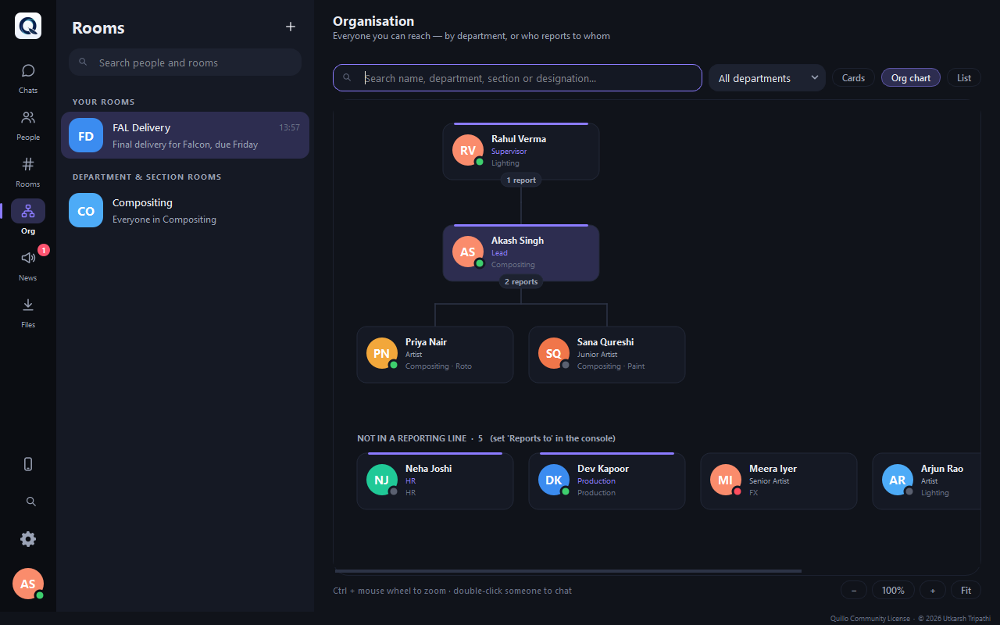
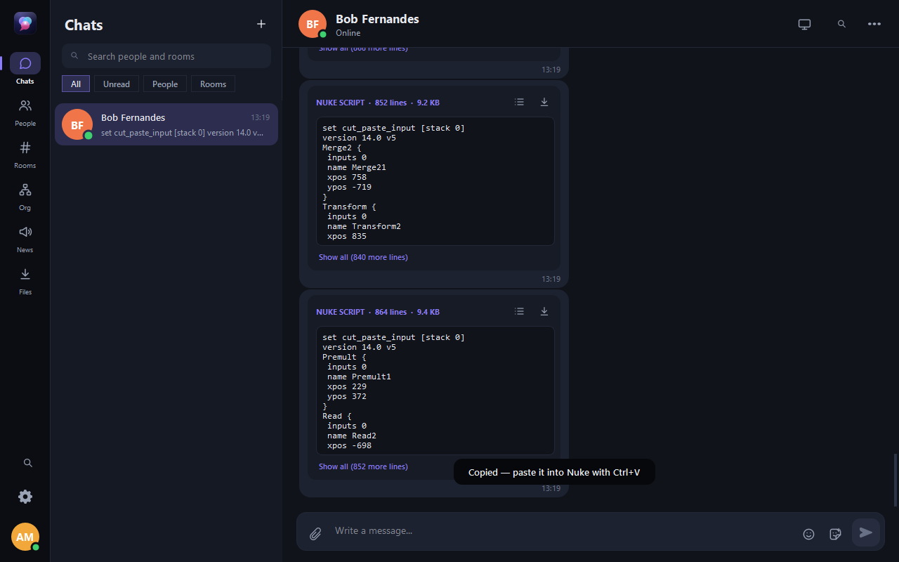
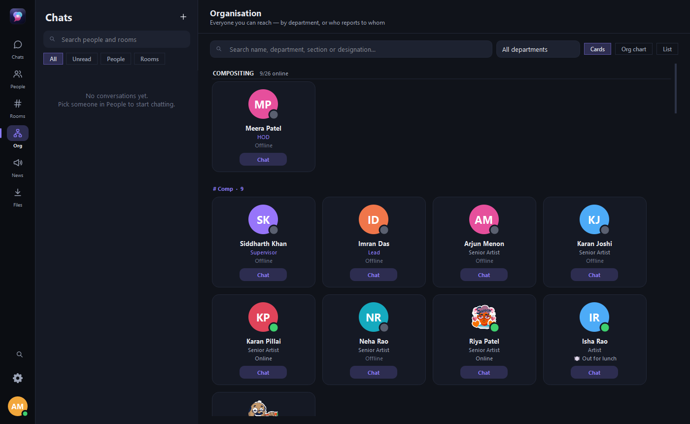
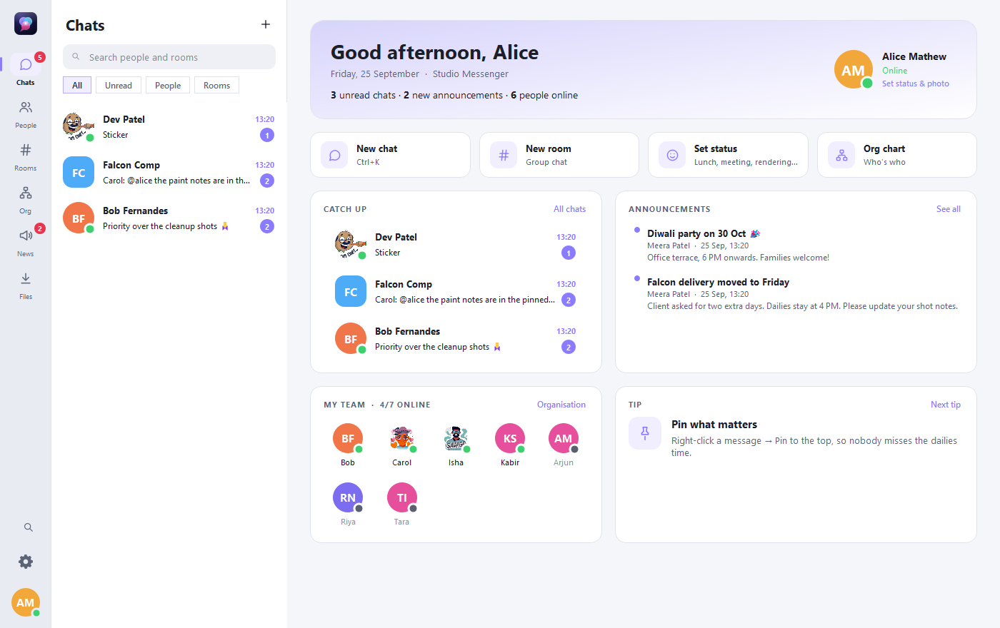
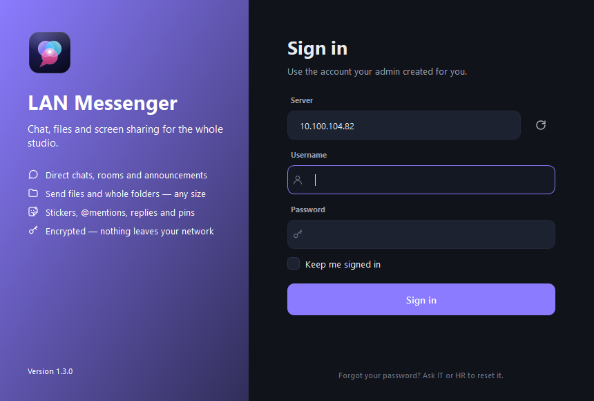
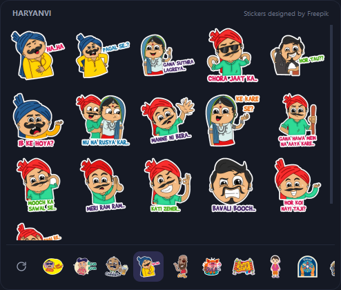
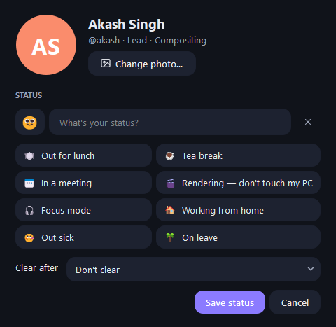

<p align="center">
  
</p>

<p align="center">
  <a href="../../releases/latest"></a>
  
  
  
</p>

<p align="center">
  <b>A private, fast messenger for VFX and animation studios.</b><br>
  Install one server, put the client on every PC, and your whole studio can chat, share files of any size,
  run polls, send stickers and see who reports to whom — without anything leaving your network.
</p>

<p align="center">
  <a href="../../releases/latest"><b>⬇ Download the latest release</b></a> ·
  <a href="docs/ADMIN.md"><b>Admin & IT guide</b></a> ·
  <a href="docs/releases/v1.3.0.md"><b>What's new in 1.3.0</b></a>
</p>

<p align="center">
  
</p>

## ✨ Highlights

<table>
<tr>
<td width="33%" valign="top">

### 💬 Chat that fits a studio
Direct chats and rooms, automatic **department and section rooms**, reply, edit, delete, forward, pin,
**@mentions**, read receipts and "seen by", **emoji reactions**, **polls** for the everyday
"which dailies slot?" questions, **reminders**, **scheduled messages**, and **Buzz** to reach someone who is
busy (it even pops a minimised app up on screen).

</td>
<td width="33%" valign="top">

### 📁 Files of any size
Up to **20 GB per file** with resume, drag & drop, pasted screenshots, image previews, and **whole
folders** (image sequences are zipped and extracted in one click). Files reach people who are offline, too.

</td>
<td width="33%" valign="top">

### 🎬 Made for artists
Paste a **Nuke script** and it becomes a code card with *Copy* and *Save as .nk*. Clickable
`\\server\share` paths, view-only **screen sharing** with consent, and a **pipeline API** so the render farm
can message you.

</td>
</tr>
<tr>
<td valign="top">

### 🏢 Knows your org
Departments, sections, designations with permissions and **reporting lines**. The Organisation page
shows people as **cards**, as a zoomable **org chart**, or as a list.

</td>
<td valign="top">

### 🎨 Fun and personal
**185 stickers** (desi chat, Uncle Ji, Haryanvi, Holi, Diwali and more), **profile photos**, custom
**status with emoji** ("🍽️ Out for lunch · 1 hour"), light / dark / follow-Windows themes with six accent colours,
a **compact view** docked to the side of the screen, and **festival themes** for Independence Day, Republic Day
and Christmas.

</td>
<td valign="top">

### 🔒 Private by design
Everything stays on your LAN, over **TLS**, with server-identity checks, password rules, lock-out, an
**audit log**, nightly **backups** plus a readable **chat backup**, and a Windows **service** that runs without
anyone logged in.

</td>
</tr>
</table>

## 📸 Screenshots

<table>
<tr>
<td width="50%"><br><sub><b>Rooms</b>: polls, reactions, mentions and photos</sub></td>
<td width="50%"><br><sub><b>Org chart</b>: who reports to whom, with zoom and search</sub></td>
</tr>
<tr>
<td><br><sub><b>Nuke scripts</b>: copy straight back into Nuke</sub></td>
<td><br><sub><b>People</b>: everyone as cards, grouped by department</sub></td>
</tr>
<tr>
<td><br><sub><b>Light theme</b>: plus Midnight and Classic, six accents</sub></td>
<td><br><sub><b>Sign in</b>: finds the server on the network by itself</sub></td>
</tr>
</table>

<p align="center">
  
  &nbsp;&nbsp;
  
</p>

## 🚀 Get started

| | Download | Where |
|---|---|---|
| 🖥️ | **LANMessenger-Server-Setup** | once, on an always-on PC (run as administrator, choose *background service*) |
| 💻 | **LANMessenger-Client-Setup** | on every artist PC (it finds the server by itself) |

Both are on the [**Releases page**](../../releases/latest).

1. Install the **server**, open **LAN Messenger Server** from the Start menu and sign in as `admin` / `admin`
   (you choose a new password straight away).
2. Add people under **Users** (or import a CSV) and set their department, designation and *Reports to*.
3. Install the **client** on every PC and sign in. That's it.

Upgrading, silent installs for IT, backups, the pipeline API and ports are all in the
[**Admin & IT guide**](docs/ADMIN.md).

## 🛠️ For developers

Python 3.12 + PySide6 (Qt 6), asyncio server with SQLite, TLS via `cryptography`, installers with PyInstaller and
Inno Setup 6.

```bash
python -m venv .venv
.venv\Scripts\pip install -r requirements.txt
.venv\Scripts\python -m server.main
.venv\Scripts\python -m client.main
.venv\Scripts\python -m unittest discover -s . -p "test_*.py"
```

Build both installers (needs [Inno Setup 6](https://jrsoftware.org/isdl.php)): run `build\build.bat`, which writes
`build\output\LANMessenger-*-Setup-x.y.z.exe`. The version number lives in `common\version.py`.

<details>
<summary><b>Project layout</b></summary>

```
client/        chat client: network (TLS + discovery), transfers, store, stickers, photos, screen sharing
  ui/          windows: main window, chat view, sidebar, pages (home, organisation, files), dialogs
server/        server: core (asyncio, routing, permissions), db (SQLite), org, tls, pipeline API, console
common/        shared: protocol, theme, icons, org views (cards / chart), version
assets/        app icon, logo, icons, sticker packs
build/         build script, Inno Setup scripts, service installer
tools/         icon, banner and sticker generators
tests/         integration tests against a real server (43 tests)
docs/          admin guide, release notes, images
```

```
 client ══TLS 5150══► server   one JSON message per line (login, send, history, typing, ...)
 client ══TLS 5150══► server   one extra connection per file transfer and per screen share
 client ──UDP 5151──► LAN      "where is the server?" broadcast; the server answers with its fingerprint
```

</details>

## 🙏 Credits

Stickers designed by **Freepik** (free licence; credit shown in the sticker picker). They were cut from the
original sheets with `tools\make_stickers.py`. The first version of the interface was inspired by the
**PyBlackBox** demo by Wanderson M. Pimenta (MIT), kept today as the *Classic* theme.
