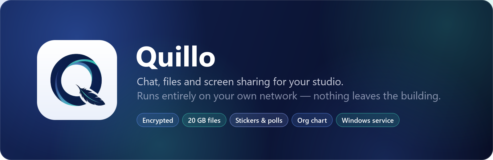
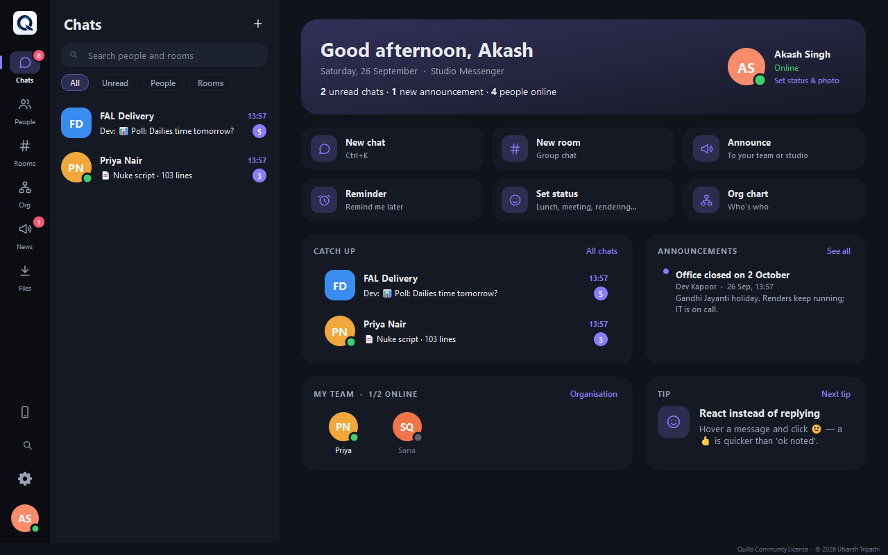
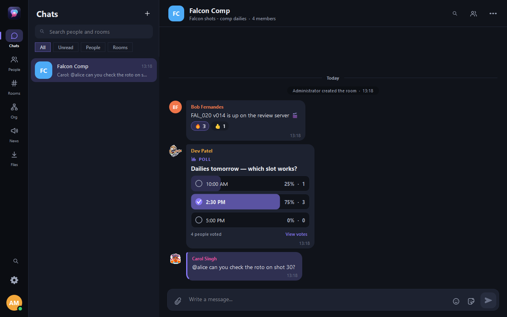
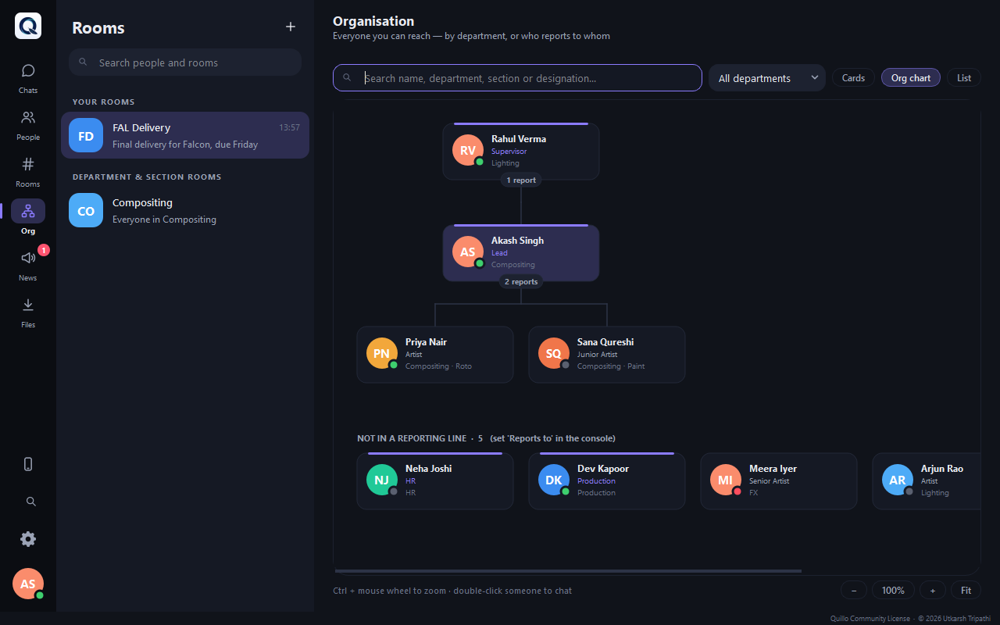
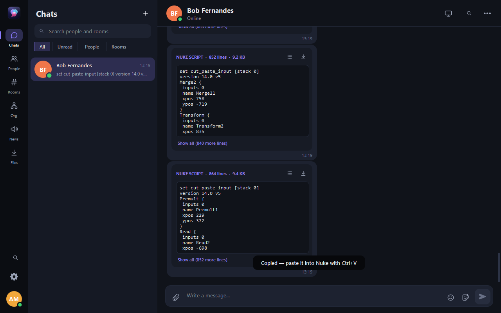
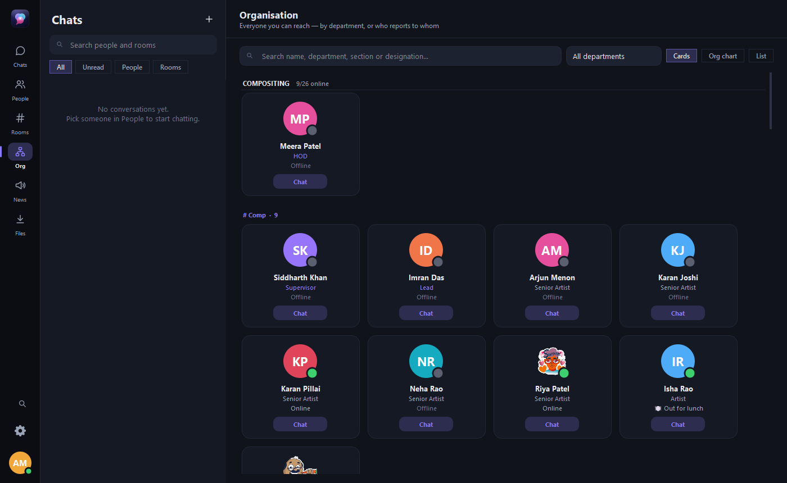
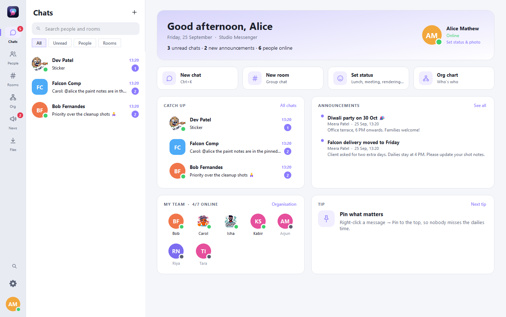
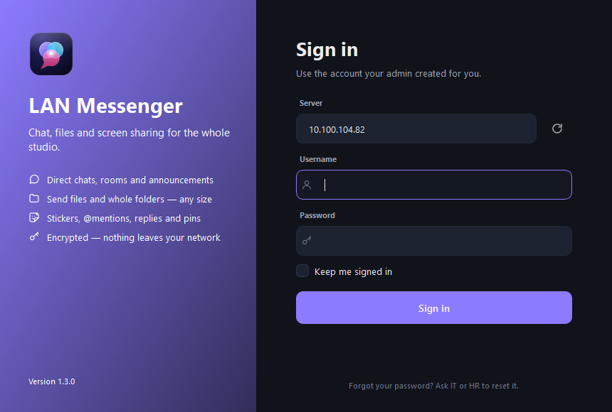
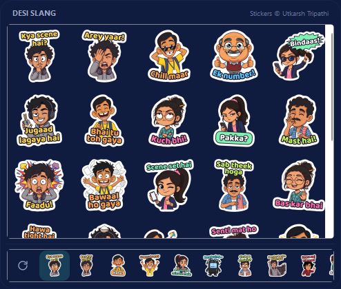
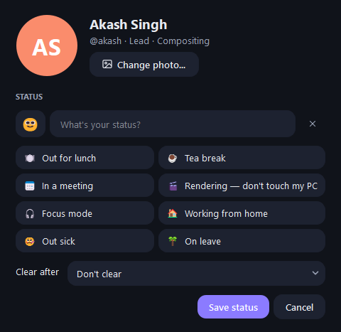

<p align="center">
  
</p>

<p align="center">
  <a href="../../releases/latest"></a>
  <a href="../../actions/workflows/build.yml"></a>
  
  
  
  <a href="LICENSE.md"></a>
</p>

<p align="center">
  <b>Quillo</b> is a private, fast messenger for VFX and animation studios.<br>
  Install one server, put the client on every PC, and your whole studio can chat, share files of any size,
  run polls, send stickers and see who reports to whom — without anything leaving your network.
</p>

<p align="center">
  <a href="../../releases/latest"><b>⬇ Download the latest release</b></a> ·
  <a href="docs/ADMIN.md"><b>Admin & IT guide</b></a> ·
  <a href="docs/releases/v1.11.0.md"><b>What's new in 1.11.0</b></a>
</p>

<p align="center">
  
</p>

## ✨ Highlights

<table>
<tr>
<td width="33%" valign="top">

### 💬 Chat that fits a studio
Direct chats and rooms, **department and section rooms** you switch on per department, **threads**, reply, edit, delete, forward, pin,
**@mentions** (people, @everyone, @here, @Department), read receipts and "seen by", **emoji reactions**, **polls** for the everyday
"which dailies slot?" questions, **reminders**, **scheduled messages** (type *mon 9:30* or *in 2h*), and **Buzz** (a person or a whole room) to reach someone who is
busy (it even pops a minimised app up on screen). Messages typed while the server is away **wait and go out
when it's back**, and search has filters (person, chat, dates, files). A **"New messages" line** shows where you
stopped reading, chats can be **pinned to the top**, and new messages **pop up with a box to answer** right there.

</td>
<td width="33%" valign="top">

### 📁 Files of any size
Up to **20 GB per file** with resume, drag & drop, pasted screenshots, image previews, and **whole
folders** (image sequences are zipped and extracted in one click). Files reach people who are offline, too.

</td>
<td width="33%" valign="top">

### 🎬 Made for artists
Paste a **Nuke script** and it becomes a code card with *Copy* and *Save as .nk*. **Shot names** like
`FAL_030` link to everything said about the shot, and **folder paths** (`\\server\proj\FAL_030\comp`,
`Z:/plates/...`, a Nuke `####` sequence) become cards that open in Explorer with one click. Pictures sent together
show as a **gallery** with a full-window viewer where you can **compare two versions** (wipe or side by side)
and **draw notes on a frame** before sending it. **Shot status** (WIP → Approved → Delivered) shows next to every
shot name, and **EXR, DPX and MOV dailies get previews** made by the server.
View-only **screen sharing** with consent, and a **pipeline API** so the render farm can message you.

</td>
</tr>
<tr>
<td valign="top">

### 🏢 Knows your org
Departments, sections, designations with permissions and **reporting lines**. The Organisation page
shows people as **cards**, as a zoomable **org chart**, or as a list. Fill the whole studio in a styled
**Excel sheet** and import it.

### 📅 A studio calendar
**Meetings** with Going / Maybe / No and repeats (every working day, weekly, monthly), **deadlines**, **notes of
the day**, **leave**, **birthdays** and work anniversaries, and India's **holidays** up to 2035 - plus a
small calendar on Home, a calendar per room and `.ics` import from Outlook or Google.

</td>
<td valign="top">

### 🎨 Fun and personal
**459 stickers in 11 packs** (Desi Slang, Reactions, Moods, Office, Studio Life, Chai Time, Filmy Dialogues, Festival Icons and more), **profile photos**, custom
**status with emoji** ("🍽️ Out for lunch · 1 hour"), light / dark / follow-Windows themes with six accent colours,
a **compact view** docked to the side of the screen, and **festival themes** for Independence Day, Republic Day
and Christmas.

</td>
<td valign="top">

### 🔒 Private by design
Everything stays on your LAN, over **TLS**, with server-identity checks, password rules, lock-out and an
**audit log**. **Administrators can't read your chats.** Everything a new server PC needs - a copy of the
database, a readable **chat backup** (a folder per room and per person), the **user list** and nightly
**backups** - is kept in one **central folder** on your file server, and a Windows **service** runs without
anyone logged in.

</td>
</tr>
</table>

## 📸 Screenshots

<table>
<tr>
<td width="50%"><br><sub><b>Rooms</b>: polls, reactions, mentions and photos</sub></td>
<td width="50%"><br><sub><b>Org chart</b>: who reports to whom, with zoom and search</sub></td>
</tr>
<tr>
<td><br><sub><b>Nuke scripts</b>: copy straight back into Nuke</sub></td>
<td><br><sub><b>People</b>: everyone as cards, grouped by department</sub></td>
</tr>
<tr>
<td><br><sub><b>Light theme</b>: plus Midnight and Classic, six accents</sub></td>
<td><br><sub><b>Sign in</b>: finds the server on the network by itself</sub></td>
</tr>
</table>

<p align="center">
  
  &nbsp;&nbsp;
  
</p>

## 🚀 Get started

| | Download | Where |
|---|---|---|
| 🖥️ | **Quillo-Server-Setup** | once, on an always-on PC (*just for me* needs no administrator; *all users* adds the background service) |
| 💻 | **Quillo-Client-Setup** | on every artist PC (it finds the server by itself) |

Both are on the [**Releases page**](../../releases/latest).

1. Install the **server**, open **Quillo Server console** from the Start menu and sign in as `admin` / `admin`
   (you choose a new password straight away).
2. Add people under **Users** (or import a CSV) and set their department, designation and *Reports to*.
3. Install the **client** on every PC and sign in. That's it.

Upgrading, silent installs for IT, backups, the pipeline API and ports are all in the
[**Admin & IT guide**](docs/ADMIN.md).

## 🛠️ For developers

Python 3.12 + PySide6 (Qt 6), asyncio server with SQLite, TLS via `cryptography`, installers with PyInstaller and
Inno Setup 6.

```bash
python -m venv .venv
.venv\Scripts\pip install -r requirements.txt
.venv\Scripts\python -m server.main
.venv\Scripts\python -m client.main
.venv\Scripts\python -m unittest discover -s . -p "test_*.py"
```

Build both installers (needs [Inno Setup 6](https://jrsoftware.org/isdl.php)): run `build\build.bat`, which writes
`build\output\Quillo-*-Setup-x.y.z.exe`. The version number lives in `common\version.py`.

**Releases are built on GitHub.** Every push runs all the tests on a fresh Windows machine
([Actions](../../actions)). To release: raise `APP_VERSION` in `common\version.py`, add
`docs\releases\vX.Y.Z.md`, commit, then `git tag vX.Y.Z` and `git push --tags`. GitHub tests, builds both
installers and opens a **draft release** with them, the notes and this build's checksums - check it and press
*Publish*.

<details>
<summary><b>Project layout</b></summary>

```
client/        chat client: network (TLS + discovery), transfers, store, stickers, photos, screen sharing
  ui/          windows: main window, chat view, sidebar, pages (home, organisation, files), dialogs
server/        server: core (asyncio, routing, permissions), db (SQLite), org, tls, pipeline API, console
common/        shared: protocol, theme, icons, org views (cards / chart), version
assets/        app icon, logo (brand/ holds the master logo), icons, sticker packs
build/         build script, Inno Setup scripts, service installer
tools/         icon and banner generators
tests/         integration tests against a real server (136 tests)
docs/          admin guide, release notes, images
```

```
 client ══TLS 5150══► server   one JSON message per line (login, send, history, typing, ...)
 client ══TLS 5150══► server   one extra connection per file transfer and per screen share
 client ──UDP 5151──► LAN      "where is the server?" broadcast; the server answers with its fingerprint
```

</details>

## 📜 License

Quillo is released under the **[UT Community Licence 2.0](LICENSE.md)** by **Utkarsh Tripathi**.

- ✅ **Free** to download, install and use, at home or across a whole studio, also for paid work, and to share unmodified copies.
- 🚫 **Not for sale.** Nobody may sell, rent or charge for Quillo or a changed copy of it.
- ✏️ **Changed it?** You're welcome to. Keep the name as *Quillo (modified by …)* and send your changes here as a pull request within 30 days, under the same licence.
- 🏷️ Keep the licence, the Credits screen and the small *Quillo · © 2026 Utkarsh Tripathi · UT Community Licence 2.0* line at the bottom of the windows. Quillo will not start without them.

This is a source-available licence, not an OSI open-source one. Copies up to 1.7.1 keep the Quillo Community License 1.0.

## 🙏 Credits

Quillo is built on Python, Qt / PySide6, cryptography, OpenSSL and openpyxl. Stickers © Utkarsh Tripathi, made for Quillo.
The first version of the interface was inspired by the **PyBlackBox** demo by Wanderson M. Pimenta (MIT), kept
today as the *Classic* theme. The full list is in [THIRD_PARTY_NOTICES.md](THIRD_PARTY_NOTICES.md) and on the
Credits screen in the app (click the line at the bottom of any window).
